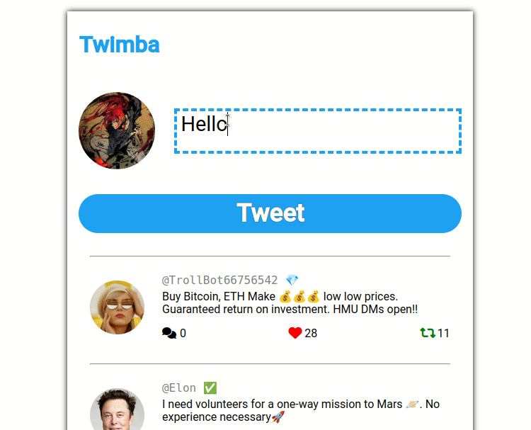
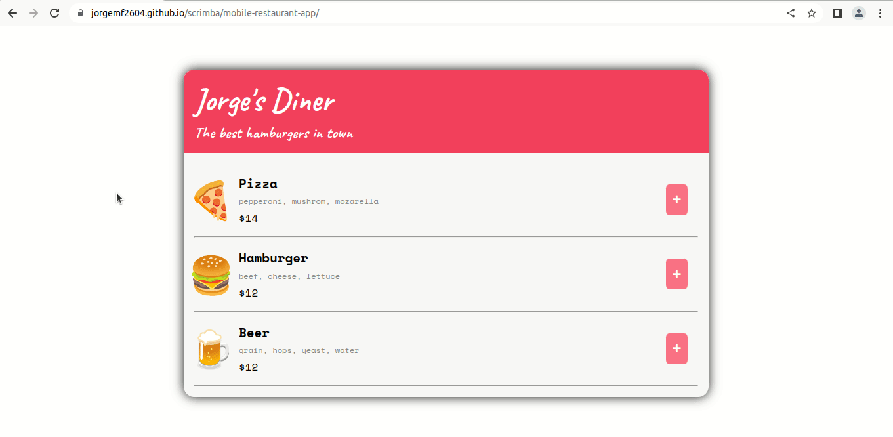

# My Scrimba repo 📚📚📚

Projects done for the Scrimba Front-End Developer Career Path.   
[Go to Scrimba](https://scrimba.com/)

# 🚧🚧🚧 Projects 🚧🚧🚧 

## 
🐦 Twimba 🐦 
 
   

**Url**: https://jorgemf2604.github.io/scrimba/twimba/  
**Readme**: https://github.com/jorgemf2604/scrimba/blob/main/twimba/README.md    
   
  
___  
 

## 
🍔 Restaurant App 🍔 
 
   

**Url**: https://jorgemf2604.github.io/scrimba/mobile-restaurant-app/  
**Readme**: https://github.com/jorgemf2604/scrimba/blob/main/mobile-restaurant-app/README.md    
   
  

___   
  